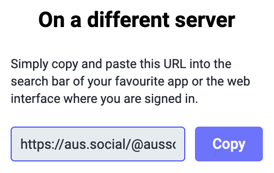
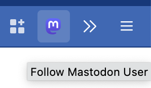

# Follow Mastodon User Browser Extension


This extension adds a button to the toolbar that will popup a window to follow
the Mastodon user on the current page. This is mostly to scratch an itch where
some mastodon pages make you have to copy the username, then search for it in
your own instance, then click follow there once the search loads.

To use a server other than mastodon.social, go to the settings page and enter
the server address including https://, omitting any trailing slash.

## Contributing

To run the extension locally, install web-ext via npm:

```shell
npm install -g web-ext
```

And then run with the following command

```shell
web-ext run --source-dir ./src --target firefox-desktop --devtools --browser-console
```

This command is also found in the [just file](https://github.com/joshka/follow-mastodon-user-webextension/blob/main/.justfile) as `just run`. (See <https://just.systems/> for more details).

## Installation

Install via <https://addons.mozilla.org/en-US/firefox/addon/follow-mastodon-user/>

Visit the extension preferences page to update your server name from the default.

## Problem

Clicking the follow button on a remote server presents a dialog where you can
copy the user name, paste it on your own instance, wait for the search to
complete and then click add. This is too many steps.



## Solution

A button on the toolbar (soon to be in the address bar), that takes you to your
server, where you click follow.



## License

Copyright ©️ 2022 Joshua McKinney

Licensed under the Apache License, Version 2.0 (the "License");
you may not use this file except in compliance with the License.
You may obtain a copy of the License at

<http://www.apache.org/licenses/LICENSE-2.0>

Unless required by applicable law or agreed to in writing, software
distributed under the License is distributed on an "AS IS" BASIS,
WITHOUT WARRANTIES OR CONDITIONS OF ANY KIND, either express or implied.
See the License for the specific language governing permissions and
limitations under the License.
